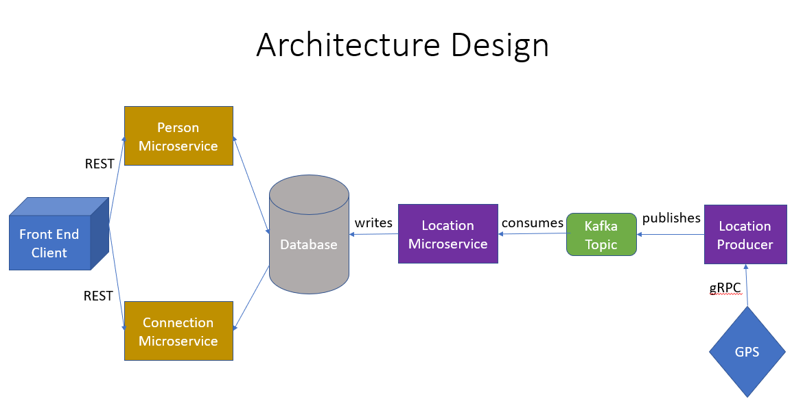

# UdaConnect Project

## Overview
Conferences and conventions are good places to make networking. Professionals who attend share same interests and can make valuable business and personal connections with one another.As these events draw large amount of people it's often hard to make these connections in the midst of all of these events' excitement and energy. To help attendees make connections, I am building the infrastructure for a service that can inform attendees if they have attended the same booths and presentations at an event.
This is done by using location data from mobile devices.

### Task
I work for a company that is building an app that uses location data from mobile devices. My company has built a Proof of concept (POC) application to ingest location data named UdaConnect. This POC was built with the core functionality of ingesting location and identifying individuals who have shared close geographic proximity.

Management loved the POC, so now that there is buy-in, we want to enhance this application. I have been tasked to enhance the POC application into a Minimum Viable Product (MVP) to handle the large volume of location data that will be ingested.

To do so, I will refactor this application into a microservice architecture using message passing techniques that I have learned in this course.

UdaConnect uses location data from mobile devices. UdaConnect has been built an application to ingest location data named UdaTracker. This POC was built with the core functionality of ingesting location and identifying individuals who have shared a close geographic proximity.


### What you need:
* [Flask](https://flask.palletsprojects.com/en/1.1.x/) - API webserver
* [SQLAlchemy](https://www.sqlalchemy.org/) - Database ORM
* [PostgreSQL](https://www.postgresql.org/) - Relational database
* [PostGIS](https://postgis.net/) - Spatial plug-in for PostgreSQL enabling geographic queries]
* [Vagrant](https://www.vagrantup.com/) - Tool for managing virtual deployed environments
* [VirtualBox](https://www.virtualbox.org/) - Hypervisor allowing you to run multiple operating systems
* [K3s](https://k3s.io/) - Lightweight distribution of K8s to easily develop against a local cluster
* [Helm](https://helm.sh/docs/intro/install/) - manager Kubernetes applications — Helm Charts helps define, install, and upgrade even the most complex Kubernetes application.

### Udaconnect Architecture




### Prerequisites
First, the following applications should be installed. 
1. [Install Docker](https://docs.docker.com/get-docker/)
2. [Set up a DockerHub account](https://hub.docker.com/)
3. [Set up `kubectl`](https://rancher.com/docs/rancher/v2.x/en/cluster-admin/cluster-access/kubectl/)
4. [Install VirtualBox](https://www.virtualbox.org/wiki/Downloads) with at least version 6.0!!
5. [Install Vagrant](https://www.vagrantup.com/docs/installation) with at least version 2.0

### Virtual Machine Environment Setup
A virtual machine is needed to run the application. There is a vagrant file in the project to set up a VM. 

#### Initialize K3s

Run $ `vagrant up` in the root
This shall take some time 

#### Setup Kubectl 

Run $ `vagrant ssh`
It retrieves the kubernetes config file used by kubectl.
You shall be connected to virtual OS.

Run `sudo su`
Run `sudo cat /etc/rancher/k3s/k3s.yaml` to see contents of the file.

Output should look as below:
apiVersion: v1
clusters:
- cluster:
    certificate-authority-data: LS0tLS1CRUdJTiBDRVJUSUZJQ0FURS0tLS0tCk1JSUJWekNCL3FBREFnRUNBZ0VBTUFvR0NDcUdTTTQ5QkFNQ01DTXhJVEFmQmdOVkJBTU1HR3N6Y3kxelpYSjIKWlhJdFkyRkFNVFU1T1RrNE9EYzFNekFlRncweU1EQTVNVE13T1RFNU1UTmFGdzB6TURBNU1URXdPVEU1TVROYQpNQ014SVRBZkJnTlZCQU1NR0dzemN5MXpaWEoyWlhJdFkyRkFNVFU1T1RrNE9EYzFNekJaTUJNR0J5cUdTTTQ5CkFnRUdDQ3FHU000OUF3RUhBMElBQk9rc2IvV1FEVVVXczJacUlJWlF4alN2MHFseE9rZXdvRWdBMGtSN2gzZHEKUzFhRjN3L3pnZ0FNNEZNOU1jbFBSMW1sNXZINUVsZUFOV0VTQWRZUnhJeWpJekFoTUE0R0ExVWREd0VCL3dRRQpBd0lDcERBUEJnTlZIUk1CQWY4RUJUQURBUUgvTUFvR0NDcUdTTTQ5QkFNQ0EwZ0FNRVVDSVFERjczbWZ4YXBwCmZNS2RnMTF1dCswd3BXcWQvMk5pWE9HL0RvZUo0SnpOYlFJZ1JPcnlvRXMrMnFKUkZ5WC8xQmIydnoyZXpwOHkKZ1dKMkxNYUxrMGJzNXcwPQotLS0tLUVORCBDRVJUSUZJQ0FURS0tLS0tCg==
    server: https://127.0.0.1:6443
  name: default
contexts:
- context:
    cluster: default
    user: default
  name: default
current-context: default
kind: Config
preferences: {}
users:
- name: default
  user:
    password: 485084ed2cc05d84494d5893160836c9
    username: admin

Run $ `kubectl describe services` to check if kubectl is installed properly. It should have no errors.

We now deploy the .yaml files. Follow the commands below to create pods.

1. `kubectl apply -f deployment/db-configmap.yaml` - Set up environment variables for the pods
2. `kubectl apply -f deployment/db-secret.yaml` - Set up secrets for the pods
3. `kubectl apply -f deployment/postgres.yaml` - Set up a Postgres database running PostGIS
4. `kubectl apply -f deployment/udaconnect-api.yaml` - Set up the service and deployment for the API v1
6. `kubectl apply -f deployment/udaconnect-persons-api.yaml` - Set up the service and deployment for the Person API
7. `kubectl apply -f deployment/udaconnect-connections-api.yaml` - Set up the service and deployment for the Connection API
8. `kubectl apply -f deployment/udaconnect-app.yaml` - Set up the service and deployment for the web app
  Then run `kubectl get pods` to see the up and running pods. 

Apply `kubectl apply -f deployment/` to create all above pods at once rather than creating individually.


10. `sh scripts/run_db_command.sh <POD_NAME>` - Seed your database against the `postgres` pod.

11. Install and configure helm in Kubernetes with following commands:

  ```
  curl -fsSL -o get_helm.sh https://raw.githubusercontent.com/helm/helm/main/scripts/get-helm-3

  chmod 700 get_helm.sh

  ./get_helm.sh
  ```
    
12. Install and configure kafka in Kubernetes with following commands:
 ```
  helm repo add bitnami https://charts.bitnami.com/bitnami

  helm install udaconnect-kafka bitnami/kafka  --kubeconfig /etc/rancher/k3s/k3s.yaml 
  ```
  

13. Check if all the pods are created without errors: 
    `kubectl get pods`
All the pods should be in running state.

14. Create the kafka topic "location-data" using the following commands:
  ```
  kubectl exec -it udaconnect-kafka-0 -- kafka-topics.sh \ --create --bootstrap-server udaconnect-kafka-headless:9092 \ --replication-factor 1 --partitions 1 \ --topic 'location-data'
  ```
Now, create the other pods:
15. `kubectl apply -f deployment/kafka-configmap.yaml` - environment variables setting up for the pods
16. `kubectl apply -f deployment/udaconnect-location-microservice.yaml`
17. `kubectl apply -f deployment/udaconnect-location-generator.yaml`

18. Test gRPC pipeline using kafka
  ##### `kubectl exec -it <location-producer-pod-name> sh`
  python grpc_client.py

### Verify
Verify the following links in browser if it works.

http://localhost:30000/ - Frontend ReactJS Application
http://localhost:30001/ - OpenAPI Documentation for legacy API
http://localhost:30001/api/ - Base path for legacy API
http://localhost:30002/ - OpenAPI Documentation for Persons API
http://localhost:30002/api/ - Base path for Persons API
http://localhost:30003/ - OpenAPI Documentation for Connections API
http://localhost:30003/api/ - Base path for Connections API